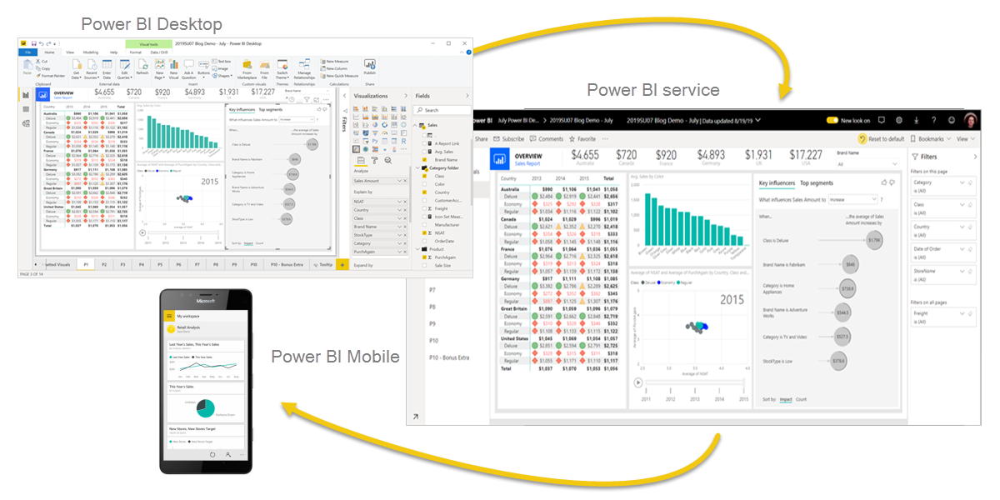

# Power BI Apps Overview
Power BI consists of Desktop, Service, and Mobile apps, each supporting the report creation and sharing process.

## Key Points:
 • Three Main Components:
 ▫ Power BI Desktop: A free Windows application for data analysts and report creators to connect, transform, model, and visualize data.
 ▫ Power BI Service: An online platform (app.powerbi.com) for publishing, managing, and distributing reports and dashboards.
 ▫ Power BI Mobile: A mobile app for viewing reports in a mobile-optimized format.
 • Typical Power BI Workflow:
 a. Connect to data using Power BI Desktop.
 b. Transform data with Power Query Editor.
 c. Model data and create visualizations/reports in Power BI Desktop.
 d. Publish reports to the Power BI Service.
 e. Distribute and manage reports and dashboards in the Power BI Service.
 • Additional Features:
 ▫ The Power BI Service allows creation of dashboards and grouping of related reports into apps for easy sharing.
 ▫ Power BI is accessible to organizations and individuals (with free trials or developer accounts available).

Power BI enables users to turn raw data into interactive, shareable insights across devices and platforms.

## The flow of Power BI is:
 1. Connect to data with Power BI Desktop.
 2. Transform data with Power Query Editor (comes with Power BI Desktop).
 3. Model data with Power BI Desktop.
 4. Create visualizations and reports with Power BI Desktop.
 5. Publish report to Power BI service.
 6. Distribute and manage reports in the Power BI service.

The Power BI workflow guides you from connecting data to sharing interactive reports and dashboards.

Here’s a closer look at each step in the Power BI flow:
 1. Connect to Data with Power BI Desktop
Start by using Power BI Desktop to connect to various data sources—these can be databases, Excel files, cloud services, or web data. Power BI supports a wide range of connectors, making it easy to bring in the data you need.
 2. Transform Data with Power Query Editor
Before analysis, data often needs cleaning or reshaping. Power Query Editor (built into Power BI Desktop) lets you filter, merge, split, and format data, ensuring it’s accurate and ready for modeling.
 3. Model Data with Power BI Desktop
Modeling involves defining relationships between tables, creating calculated columns or measures, and building a semantic layer. This step makes your data more meaningful and easier to analyze.
 4. Create Visualizations and Reports
With clean, modeled data, you can build interactive visualizations—charts, maps, tables, and more. These visuals help users explore trends, patterns, and insights.
 5. Publish Report to Power BI Service
Once your report is ready, you publish it to the Power BI Service (the online platform). This makes your report accessible to others in your organization.
 6. Distribute and Manage Reports in the Power BI Service
In the Power BI Service, you can share reports, set up dashboards (which can combine visuals from multiple reports), and organize content into apps for easy access by different teams or departments. You can also manage permissions, schedule data refreshes, and monitor usage.

Dashboards and Apps:
 • Dashboards are high-level, customizable views that can display key metrics from multiple reports in one place.
 • Apps group related reports and dashboards together, making it simple for users to find and use the analytics relevant to them.

This workflow ensures that data moves smoothly from raw sources to actionable, shareable insights, supporting better decision-making across your organization.