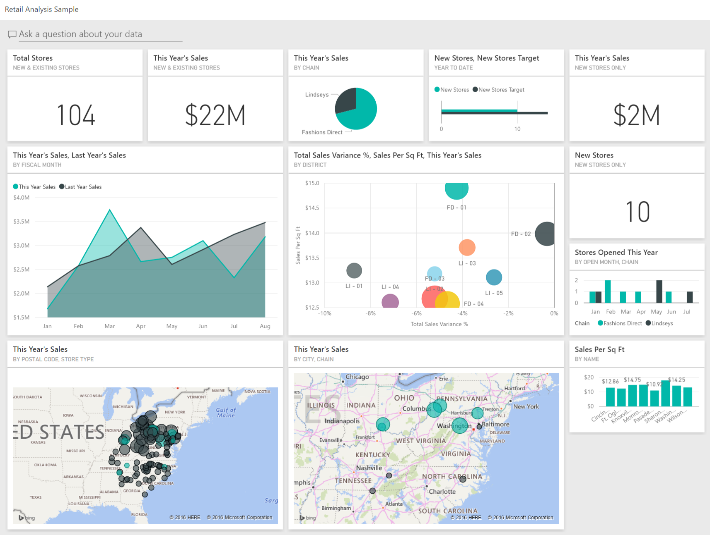

The core building blocks of Power BI are semantic models and visualizations, which together enable effective reporting and dashboards.

Recap:

## Semantic Model:

 - Combines all connected data, transformations, relationships, and calculations.
 - Created by connecting to data sources, cleaning and transforming data (using Power Query Editor), and defining relationships and calculations.
 - Forms the foundation for building reports.

## Visualizations (Visuals):

 - Created in Power BI Desktop by dragging and dropping data fields onto the report canvas.
 - Visuals can be easily changed, and fields can be added or removed.
 - Reports are interactive—users can filter, drill through, and explore data dynamically.

## Dashboards:

 - Built in the Power BI Service after publishing a report.
 - Consist of tiles pinned from report visuals, providing a high-level overview.
 - Tiles link back to the underlying report for more detail.
 - Dashboards are ideal for sharing key information at a glance.

Summary:
In Power BI, you first build a semantic model, then use visuals to create interactive reports, and finally, assemble dashboards for high-level insights and easy sharing.