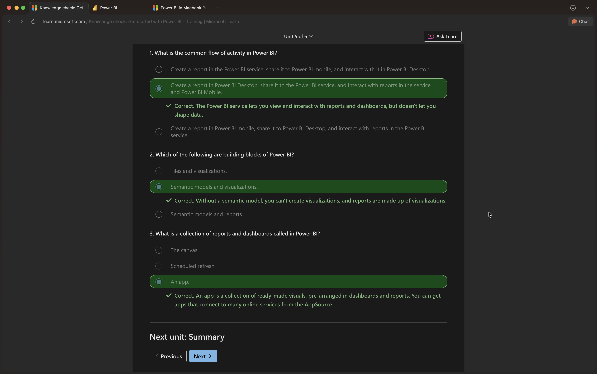

# Power BI Quick Study Guide

## The typical Power BI workflow is:

 - Create a report in Power BI Desktop.
 - Share it to the Power BI Service.
 - View and interact with reports and dashboards in the service and on Power BI Mobile.

## The main building blocks of Power BI are semantic 

models (how data is structured and related) and visualizations (how data is represented visually). You need a semantic model before you can create visualizations and reports.

## In Power BI, a collection of reports and 

dashboards is called an app. Apps provide ready-made visuals and layouts, and you can find many pre-built apps in Microsoft AppSource to connect to various online services.

So, to summarize:
Microsoft Power BI offers a complete data analytics solution that includes data preparation, visualization, and distribution. Semantic models and visualizations are the building blocks of Power BI.

The flow and components of Power BI include:

Power BI Desktop for creating semantic models and reports with visualizations.
Power BI service for creating dashboards from published reports and distributing content with apps.
Power BI Mobile for on-the-go access to the Power BI service content, designed for mobile.
By using Power BI, you can make data-informed decisions across your organization.